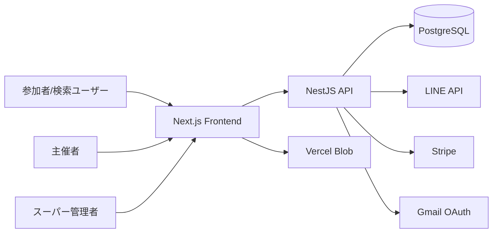

# 基本設計

## アーキテクチャ

## レイヤ

| レイヤ | 技術 | 責務 |
| --- | --- | --- |
| Frontend | Next.js App Router | 画面、SEO、LIFF UI、管理UI |
| API | NestJS | 認証、業務ロジック、外部API連携 |
| DB | PostgreSQL + Prisma | 永続化、migration、リレーション |
| External | LINE/Stripe/Gmail/Blob | 認証、通知、決済、画像保存 |

## フロントエンド構成

| 領域 | パス |
| --- | --- |
| 公開トップ | `/` |
| 公開イベント | `/e/[tenantCode]/[eventId]` |
| 公開団体 | `/clubs/[tenantCode]` |
| スポーツカテゴリ | `/sports/[category]` |
| 活用事例 | `/use-cases`, `/use-cases/[slug]` |
| 管理画面 | `/admin/**` |
| LIFF | `/liff/[tenantId]/**` |
| スーパー管理 | `/superadmin/**` |
| 認証 | `/login`, `/register`, `/auth/**`, `/reset-password` |

## バックエンド構成

| Module | 責務 |
| --- | --- |
| AuthModule | 登録、ログイン、LINE Login、メール確認、再認証 |
| TenantModule | テナント設定、統計、課金Checkout、サポート |
| EventsModule | イベントCRUD、予約者、レビュー、通知、CSV |
| MembersModule | メンバー管理、ブロック、メッセージ |
| ReservationsModule | 管理画面からの予約状態更新 |
| LiffModule | 参加者向けLIFF API |
| PublicModule | 公開ページ/API、sitemapデータ |
| StripeModule | Stripe Webhook、課金更新 |
| WebhookModule | LINE Webhook |
| SchedulerModule | リマインド等の定期処理 |
| SuperadminModule | 運営者向け管理 |
| UploadModule | バックエンドアップロード |

## マルチテナント方針

- 管理APIはJWTから `tenantId` を取得する。
- Service層のDB検索条件に `tenantId` を含める。
- 公開ページは公開用 `tenant.code` を使用する。
- LIFF APIは `tenantId` として内部IDまたは公開コードを受ける箇所がある。
- スーパー管理者のみテナント横断アクセスを許可する。

## SEO基本方針

- 公開ページは検索流入向けにindex可能にする。
- 管理、認証、LIFF、代理ログインはnoindexにする。
- 動的公開ページはAPIからデータを取得してmetadataを生成する。
- sitemapは静的ページ、公開団体、公開イベントを含む。

## 主要データ

- Tenant: 団体/テナント
- OrganizerAccount: 主催者アカウント
- Event: イベント
- Member: LINE参加者
- Reservation: 予約
- EventReview: レビュー
- AdminMemberMessage / SupportMessage / Message: メッセージ
- Connection: 参加者同士のつながり
- PushSubscription / Notification: 通知
