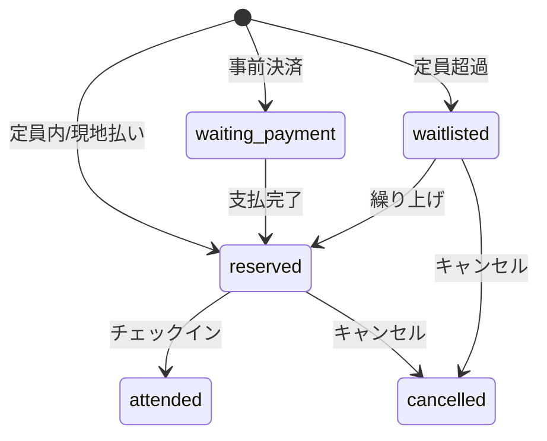
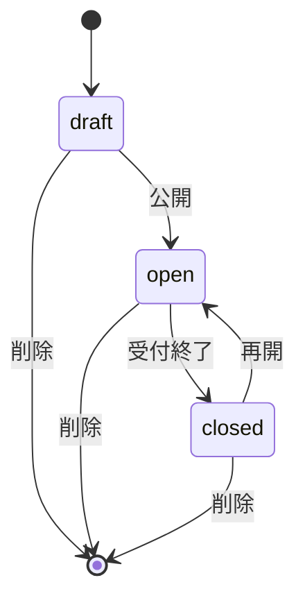

# 詳細設計・内部設計

## Backend内部設計

### Guard

| Guard | 役割 |
| --- | --- |
| AdminGuard | JWTを検証し、管理APIの `tenantId` / `accountId` を確定する |
| SuperadminGuard | スーパー管理者権限を検証する |
| ThrottlerGuard | 全体レート制限を適用する |

### TenantId Decorator

`@TenantId()` は `req.user.tenantId` をController引数として取り出す。管理APIではこの値をService層に渡し、DB検索条件に含める。

### EventService

主な責務:

- イベントCRUD
- プラン制限確認
- 予約数集計
- 予約者一覧
- レビュー公開制御
- リマインド送信
- チェックイン
- 参加者へのメッセージ送信
- CSV生成

### LiffService

主な責務:

- テナント情報取得
- アクセス記録
- LIFFイベント一覧・詳細
- 予約作成・キャンセル
- プロフィール管理
- レビュー投稿/取得
- コネクション作成
- 参加者同士メッセージ
- 管理者トーク
- 通知
- サポート

### TenantService

主な責務:

- テナント設定取得/更新
- 機密設定変更時の再認証
- ダッシュボード統計
- 成長データ
- 活動履歴
- LINEプロフィール同期
- Stripe Checkout作成
- サポートメッセージ

### AuthService

主な責務:

- メール登録
- ログイン
- メール確認
- パスワードリセット
- LINE Login URL生成/Callback処理
- LINE登録完了
- JWT発行
- 再認証

## Frontend内部設計

### API Client

`frontend/src/lib/api.ts` にAPI呼び出しを集約する。

- `request<T>()` がfetch、エラーハンドリング、認証ヘッダ付与を担当する
- 管理APIとスーパー管理APIはJWTを付与する
- 401時はトークンを削除しログインへ遷移する

### Auth

`frontend/src/lib/auth.ts` がJWTの保存、取得、削除を担当する。保存先はブラウザ側ストレージである。

### LIFF

`frontend/src/lib/liff.ts` がLIFF初期化とLINEプロフィール取得を担当する。参加者画面では `lineUserId` をAPIに渡す。

### SEO

各公開ページでNext.js Metadata APIを使う。

- `layout.tsx`: サイト共通metadata
- `page.tsx`: トップページmetadataとWebSite/Organization JSON-LD
- `/e/**`: Event JSON-LD
- `/clubs/**`: Organization/Breadcrumb/ItemList JSON-LD
- `/sports/**`: FAQPage/Breadcrumb/ItemList JSON-LD
- `robots.ts`: robots.txt
- `sitemap.ts`: sitemap.xml

## 予約状態

## イベント状態

## データ分離

- Tenantをルートエンティティとする
- Event/Member/Reservation/Message等は `tenantId` を持つ
- 管理APIでは必ず `tenantId` を検索条件に含める
- Superadminだけ横断操作できる

## 画像処理

- フロントアップロードAPIはVercel Blobへ保存する
- バックエンドアップロードAPIは `public/uploads` に保存する
- 公開表示では `IMAGE_BASE_URL` を利用し、Next.js image remotePatternsで許可する

## バッチ/スケジューラ

`SchedulerModule` がリマインド等の定期処理を担当する。重複送信を避けるため、イベントの `remindedAt` を利用する。
