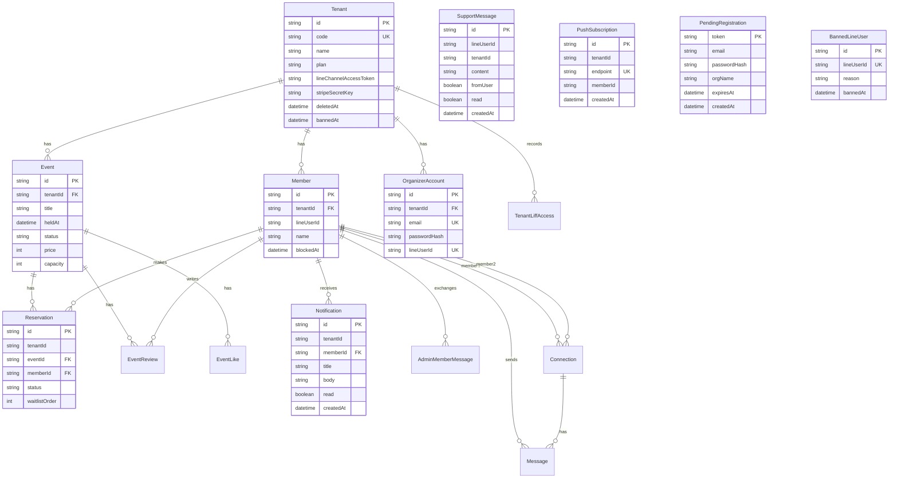

# DB設計・ER図

## 概要

DBはPostgreSQL、ORMはPrisma。テナントを中心としたマルチテナント設計で、主要テーブルは `tenantId` を持つ。

## ER図

## 主要テーブル

### tenants

団体・テナント。LINE、Stripe、プラン、公開コード、テーマ、論理削除、BAN状態を持つ。

重要カラム:

- `id`: 内部ID
- `code`: 公開URL用コード
- `plan`: SaaSプラン
- `lineChannelAccessToken`: LINE通知用
- `stripeSecretKey`: テナント決済用
- `deletedAt`: 停止/論理削除
- `bannedAt`: BAN

### organizer_accounts

主催者アカウント。メール/パスワード、LINE Login、メール確認、パスワードリセットを扱う。

### events

イベント。日時、場所、定員、価格、画像、通知設定、SEO用カテゴリ/タグを持つ。

### members

LINE参加者。テナントごとに `lineUserId` が一意。プロフィールとブロック状態を持つ。

### reservations

予約。`reserved` / `waitlisted` / `waiting_payment` / `attended` / `cancelled` を持つ。

### event_reviews

イベントレビュー。1イベント1メンバー1レビュー。管理者が公開制御する。

### notifications

参加者向けアプリ内通知。既読管理あり。

### admin_member_messages / support_messages / messages

- `admin_member_messages`: 主催者と参加者のトーク
- `support_messages`: 参加者/主催者とCOMIU運営のサポート（`lineUserId` は参加者は実ID、主催者は `tenant:{tenantId}` 形式）
- `messages`: 参加者同士のコネクション内メッセージ

### push_subscriptions

Web Push通知のサブスクリプション情報。テナントおよびメンバー単位で管理。

### pending_registrations

メール確認完了前の仮登録データ。`expiresAt` を過ぎたレコードは無効。

### banned_line_users

BANされたLINEユーザー。LIFF認証時にチェックし、アクセスを拒否する。

## インデックス/制約

- `Tenant.code` はunique
- `OrganizerAccount.email` はunique
- `OrganizerAccount.lineUserId` はunique
- `Member` は `(tenantId, lineUserId)` がunique
- `Connection` は `(member1Id, member2Id)` がunique
- `EventReview` は `(eventId, memberId)` がunique
- `EventLike` は `(eventId, anonymousId)` がunique
- サポート/通知/アクセスログは検索用indexを持つ

## 削除方針

- テナントは `deletedAt` による論理削除を基本とする
- スーパー管理者のみ物理削除を実行できる
- 一部リレーションは `onDelete: Cascade` を利用する

## Migration

- schema変更は `backend/prisma/migrations` で管理する
- 本番適用は `npx prisma migrate deploy`
- 開発DBの状態確認は `npx prisma migrate status`
