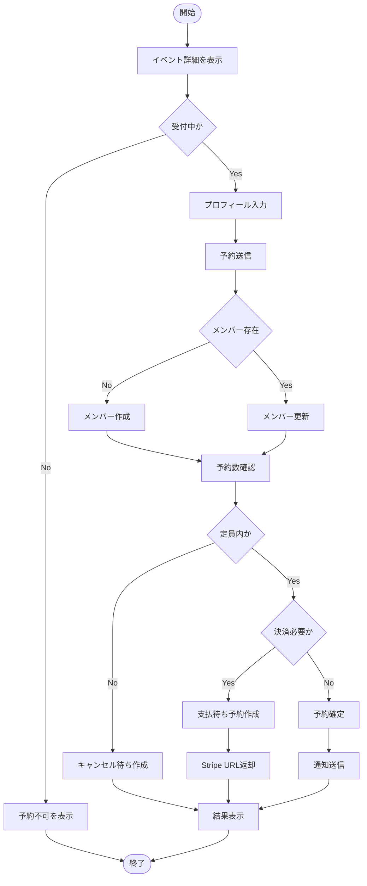

# アクティビティ図: 予約

```mermaid
flowchart TD
  A([開始]) --> B[イベント詳細を表示]
  B --> C{受付中か}
  C -- No --> Z[予約不可を表示] --> End([終了])
  C -- Yes --> D[プロフィール入力]
  D --> E[予約送信]
  E --> F{メンバー存在}
  F -- No --> G[メンバー作成]
  F -- Yes --> H[メンバー更新]
  G --> I[予約数確認]
  H --> I
  I --> J{定員内か}
  J -- No --> K[キャンセル待ち作成]
  J -- Yes --> L{決済必要か}
  L -- Yes --> M[支払待ち予約作成]
  M --> N[Stripe URL返却]
  L -- No --> O[予約確定]
  O --> P[通知送信]
  K --> Q[結果表示]
  N --> Q
  P --> Q
  Q --> End([終了])
```
