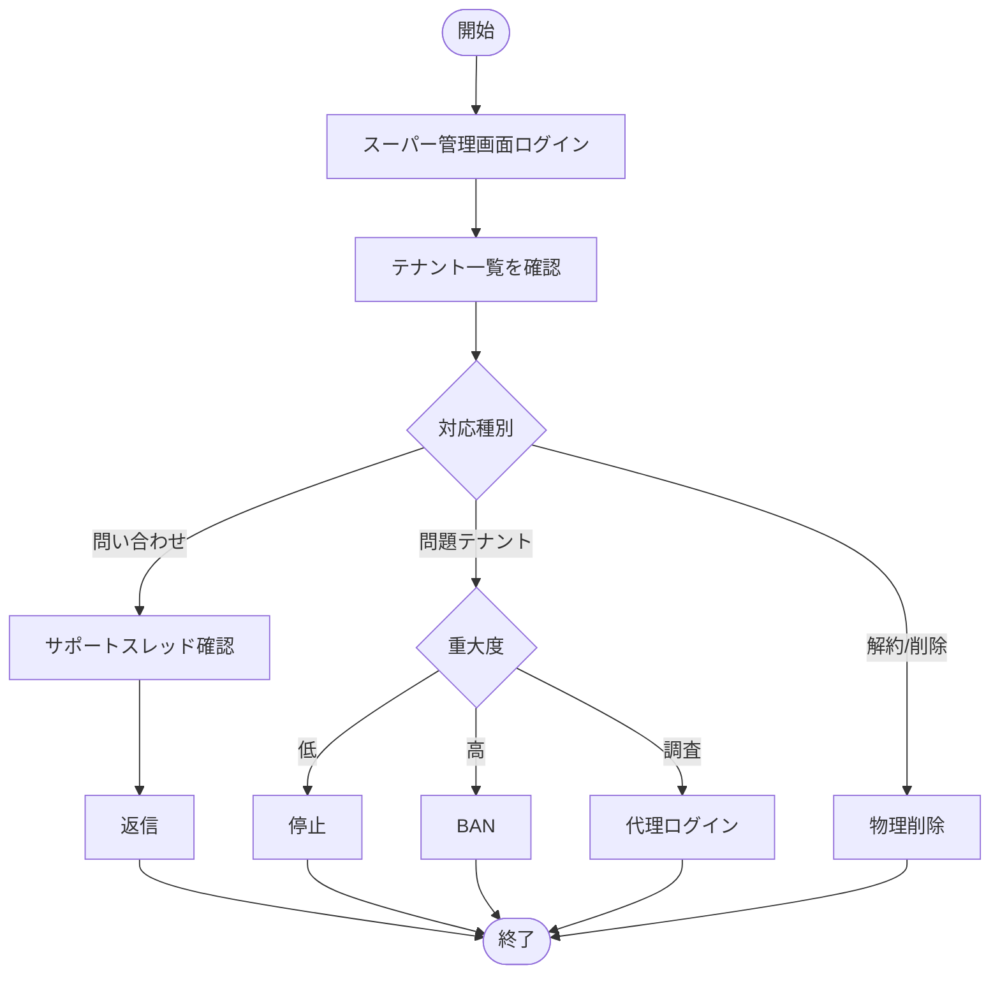

# アクティビティ図: スーパー管理者のテナント対応

```mermaid
flowchart TD
  A([開始]) --> B[スーパー管理画面ログイン]
  B --> C[テナント一覧を確認]
  C --> D{対応種別}
  D -- 問い合わせ --> E[サポートスレッド確認]
  E --> F[返信]
  D -- 問題テナント --> G{重大度}
  G -- 低 --> H[停止]
  G -- 高 --> I[BAN]
  G -- 調査 --> J[代理ログイン]
  D -- 解約/削除 --> K[物理削除]
  F --> End([終了])
  H --> End
  I --> End
  J --> End
  K --> End
```
