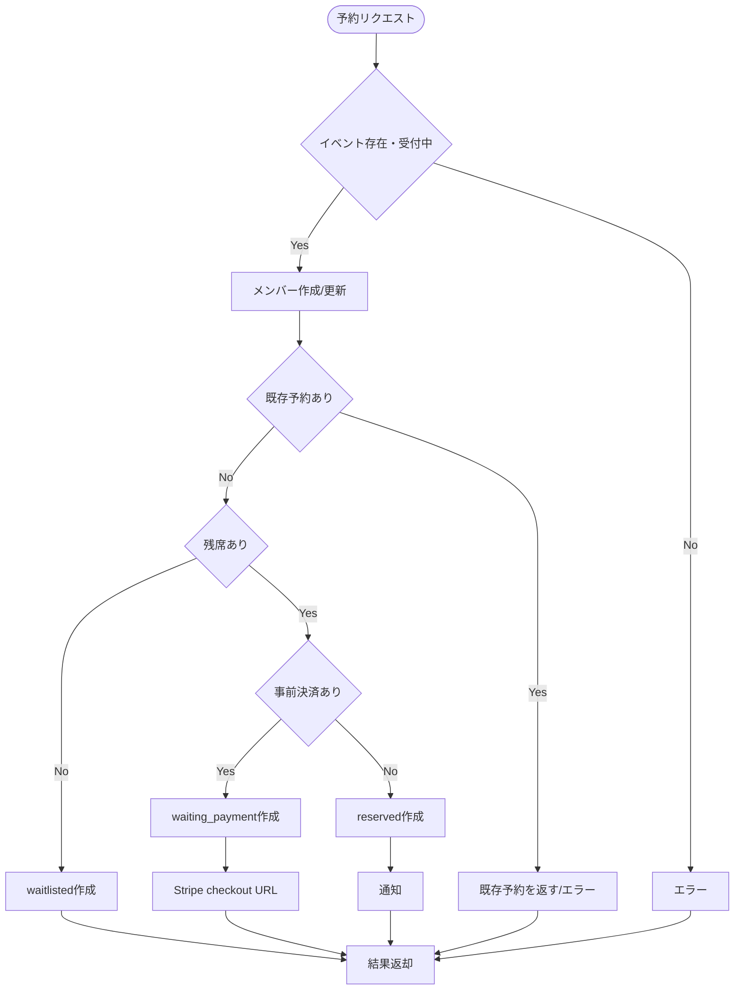

# フローチャート: 予約状態判定

```mermaid
flowchart TD
  Start([予約リクエスト]) --> EventCheck{イベント存在・受付中}
  EventCheck -- No --> Reject[エラー]
  EventCheck -- Yes --> Member[メンバー作成/更新]
  Member --> Duplicate{既存予約あり}
  Duplicate -- Yes --> Existing[既存予約を返す/エラー]
  Duplicate -- No --> Capacity{残席あり}
  Capacity -- No --> Waitlisted[waitlisted作成]
  Capacity -- Yes --> Payment{事前決済あり}
  Payment -- Yes --> Waiting[waiting_payment作成]
  Waiting --> Checkout[Stripe checkout URL]
  Payment -- No --> Reserved[reserved作成]
  Reserved --> Notify[通知]
  Waitlisted --> Result[結果返却]
  Checkout --> Result
  Notify --> Result
  Existing --> Result
  Reject --> Result
```
