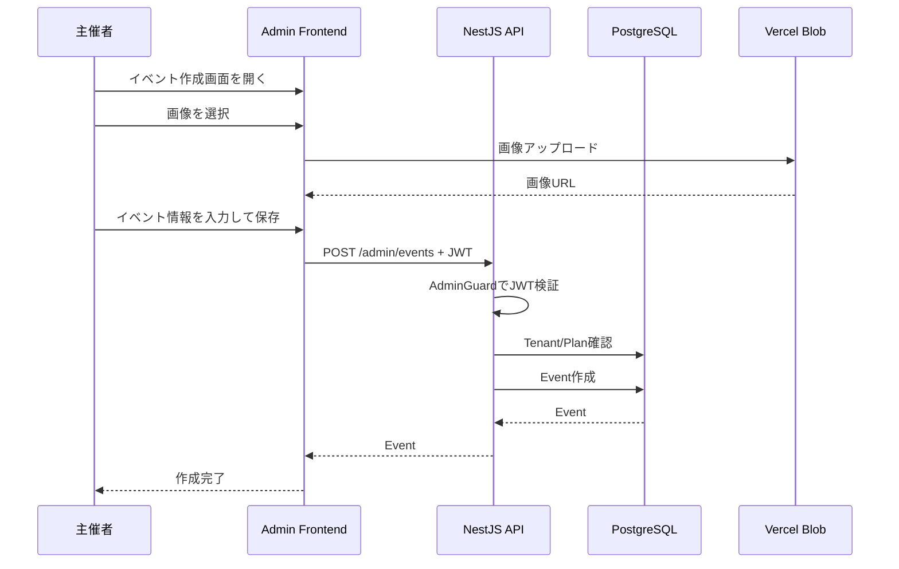

# シーケンス図: 主催者イベント作成

```mermaid
sequenceDiagram
  participant O as 主催者
  participant F as Admin Frontend
  participant A as NestJS API
  participant D as PostgreSQL
  participant B as Vercel Blob

  O->>F: イベント作成画面を開く
  O->>F: 画像を選択
  F->>B: 画像アップロード
  B-->>F: 画像URL

  O->>F: イベント情報を入力して保存
  F->>A: POST /admin/events + JWT
  A->>A: AdminGuardでJWT検証
  A->>D: Tenant/Plan確認
  A->>D: Event作成
  D-->>A: Event
  A-->>F: Event
  F-->>O: 作成完了
```
