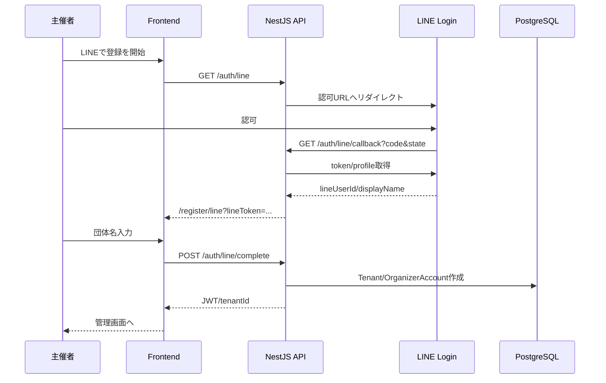

# シーケンス図: 主催者LINE Login登録

```mermaid
sequenceDiagram
  participant O as 主催者
  participant F as Frontend
  participant A as NestJS API
  participant LINE as LINE Login
  participant D as PostgreSQL

  O->>F: LINEで登録を開始
  F->>A: GET /auth/line
  A->>LINE: 認可URLへリダイレクト
  O->>LINE: 認可
  LINE->>A: GET /auth/line/callback?code&state
  A->>LINE: token/profile取得
  LINE-->>A: lineUserId/displayName
  A-->>F: /register/line?lineToken=...
  O->>F: 団体名入力
  F->>A: POST /auth/line/complete
  A->>D: Tenant/OrganizerAccount作成
  A-->>F: JWT/tenantId
  F-->>O: 管理画面へ
```
