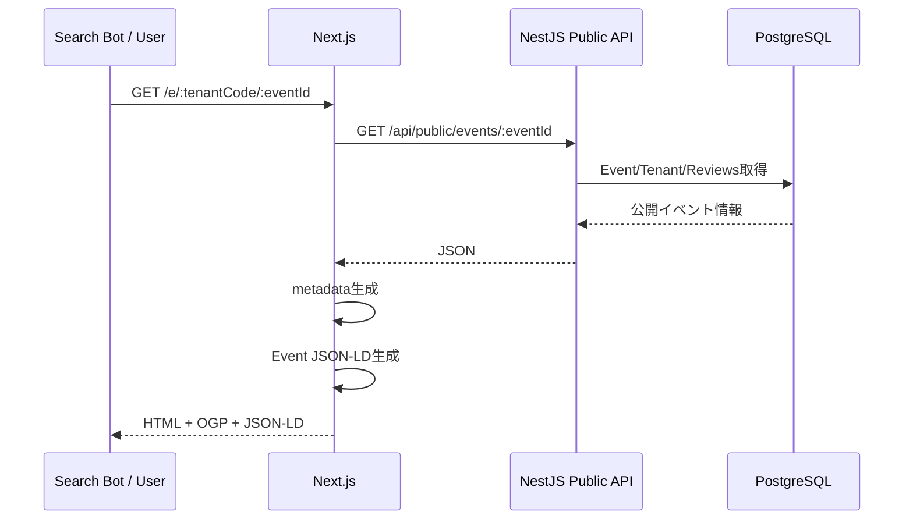

# シーケンス図: 公開イベントページSEO

```mermaid
sequenceDiagram
  participant Bot as Search Bot / User
  participant N as Next.js
  participant A as NestJS Public API
  participant D as PostgreSQL

  Bot->>N: GET /e/:tenantCode/:eventId
  N->>A: GET /api/public/events/:eventId
  A->>D: Event/Tenant/Reviews取得
  D-->>A: 公開イベント情報
  A-->>N: JSON
  N->>N: metadata生成
  N->>N: Event JSON-LD生成
  N-->>Bot: HTML + OGP + JSON-LD
```
