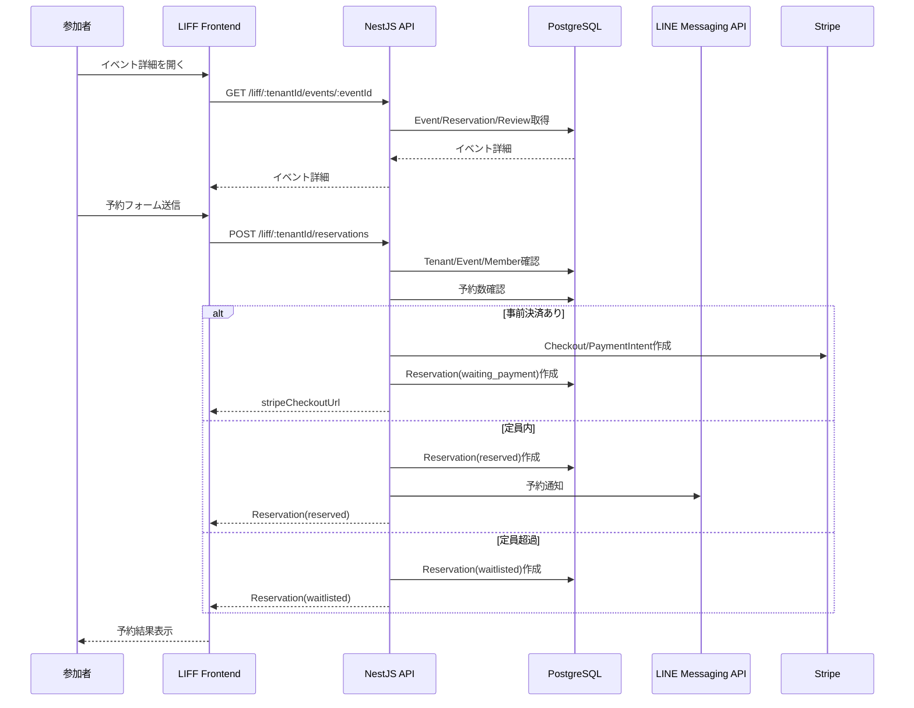

# シーケンス図: LIFF予約

```mermaid
sequenceDiagram
  participant U as 参加者
  participant F as LIFF Frontend
  participant A as NestJS API
  participant D as PostgreSQL
  participant L as LINE Messaging API
  participant S as Stripe

  U->>F: イベント詳細を開く
  F->>A: GET /liff/:tenantId/events/:eventId
  A->>D: Event/Reservation/Review取得
  D-->>A: イベント詳細
  A-->>F: イベント詳細

  U->>F: 予約フォーム送信
  F->>A: POST /liff/:tenantId/reservations
  A->>D: Tenant/Event/Member確認
  A->>D: 予約数確認

  alt 事前決済あり
    A->>S: Checkout/PaymentIntent作成
    A->>D: Reservation(waiting_payment)作成
    A-->>F: stripeCheckoutUrl
  else 定員内
    A->>D: Reservation(reserved)作成
    A->>L: 予約通知
    A-->>F: Reservation(reserved)
  else 定員超過
    A->>D: Reservation(waitlisted)作成
    A-->>F: Reservation(waitlisted)
  end

  F-->>U: 予約結果表示
```
