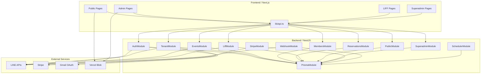

# UML コンポーネント図

```mermaid
flowchart TB
  subgraph Frontend["Frontend / Next.js"]
    PublicPages["Public Pages"]
    AdminPages["Admin Pages"]
    LiffPages["LIFF Pages"]
    SuperadminPages["Superadmin Pages"]
    ApiClient["lib/api.ts"]
  end

  subgraph Backend["Backend / NestJS"]
    Auth["AuthModule"]
    Tenant["TenantModule"]
    Events["EventsModule"]
    Members["MembersModule"]
    Reservations["ReservationsModule"]
    Liff["LiffModule"]
    Public["PublicModule"]
    Superadmin["SuperadminModule"]
    Stripe["StripeModule"]
    Webhook["WebhookModule"]
    Scheduler["SchedulerModule"]
    Prisma["PrismaModule"]
  end

  subgraph External["External Services"]
    LINE["LINE APIs"]
    STRIPE["Stripe"]
    GMAIL["Gmail OAuth"]
    BLOB["Vercel Blob"]
  end

  PublicPages --> ApiClient
  AdminPages --> ApiClient
  LiffPages --> ApiClient
  SuperadminPages --> ApiClient
  ApiClient --> Auth
  ApiClient --> Tenant
  ApiClient --> Events
  ApiClient --> Members
  ApiClient --> Reservations
  ApiClient --> Liff
  ApiClient --> Public
  ApiClient --> Superadmin

  Auth --> Prisma
  Tenant --> Prisma
  Events --> Prisma
  Members --> Prisma
  Reservations --> Prisma
  Liff --> Prisma
  Public --> Prisma
  Superadmin --> Prisma
  Stripe --> Prisma
  Webhook --> Prisma
  Scheduler --> Prisma

  Auth --> LINE
  Tenant --> LINE
  Events --> LINE
  Liff --> LINE
  Webhook --> LINE
  Stripe --> STRIPE
  Tenant --> STRIPE
  Auth --> GMAIL
  PublicPages --> BLOB
  AdminPages --> BLOB
```
