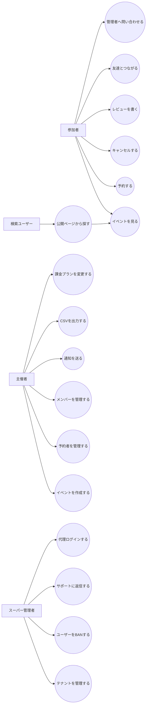

# ユースケース図

```mermaid
flowchart LR
  Participant[参加者]
  Organizer[主催者]
  Superadmin[スーパー管理者]
  SearchUser[検索ユーザー]

  UC1((イベントを見る))
  UC2((予約する))
  UC3((キャンセルする))
  UC4((レビューを書く))
  UC5((友達とつながる))
  UC6((管理者へ問い合わせる))

  UC7((イベントを作成する))
  UC8((予約者を管理する))
  UC9((メンバーを管理する))
  UC10((通知を送る))
  UC11((CSVを出力する))
  UC12((課金プランを変更する))

  UC13((テナントを管理する))
  UC14((ユーザーをBANする))
  UC15((サポートに返信する))
  UC16((代理ログインする))

  UC17((公開ページから探す))

  Participant --> UC1
  Participant --> UC2
  Participant --> UC3
  Participant --> UC4
  Participant --> UC5
  Participant --> UC6

  Organizer --> UC7
  Organizer --> UC8
  Organizer --> UC9
  Organizer --> UC10
  Organizer --> UC11
  Organizer --> UC12

  Superadmin --> UC13
  Superadmin --> UC14
  Superadmin --> UC15
  Superadmin --> UC16

  SearchUser --> UC17
  UC17 --> UC1
```
